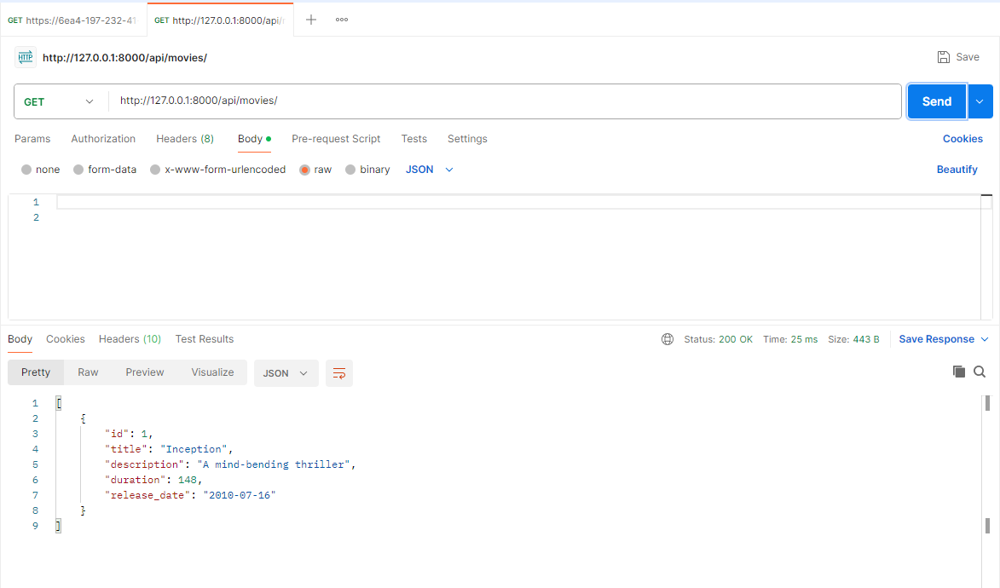
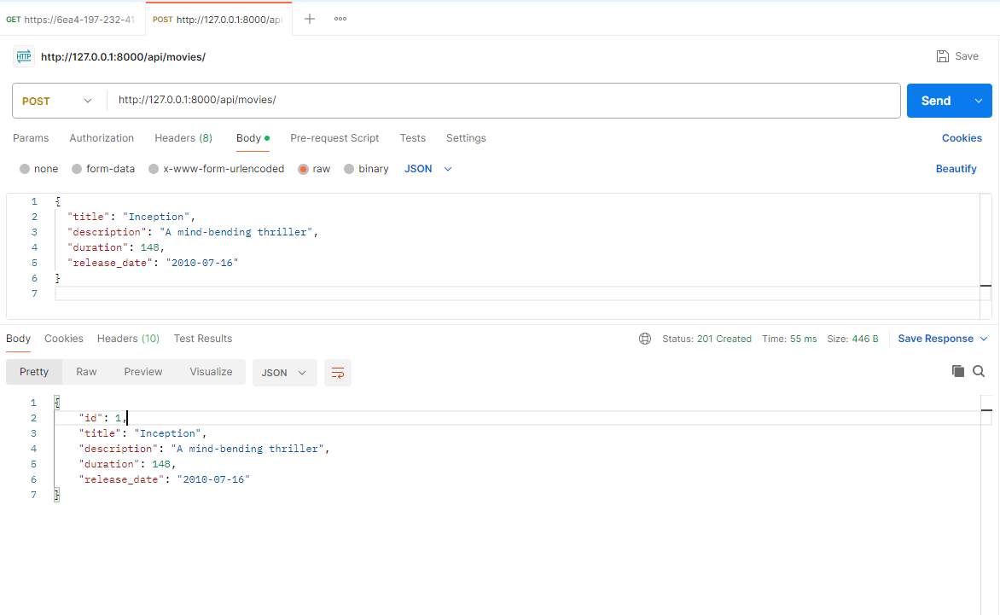
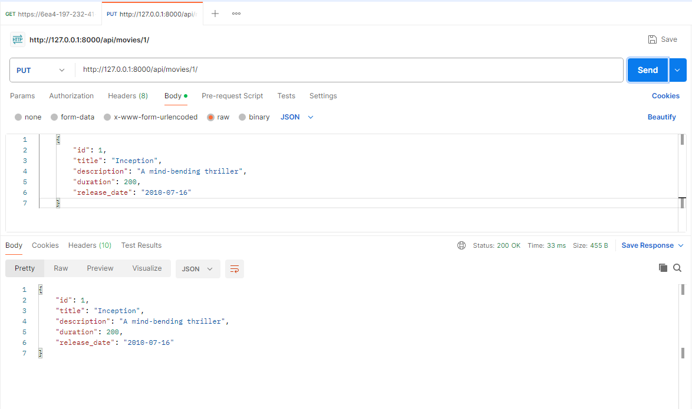
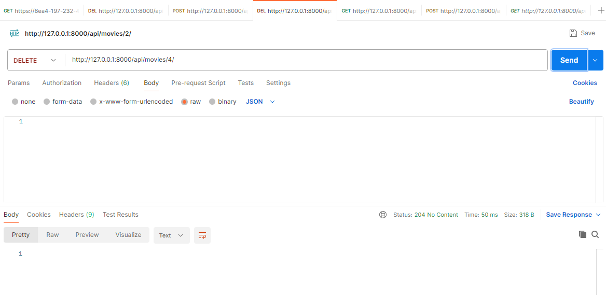
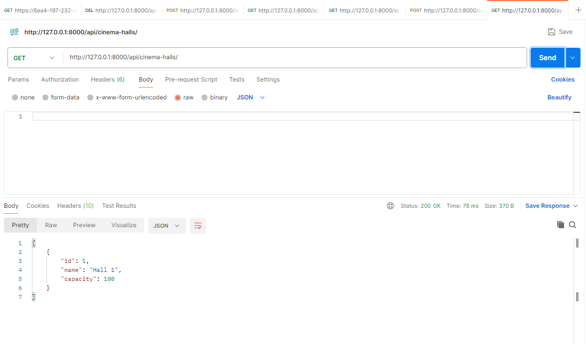
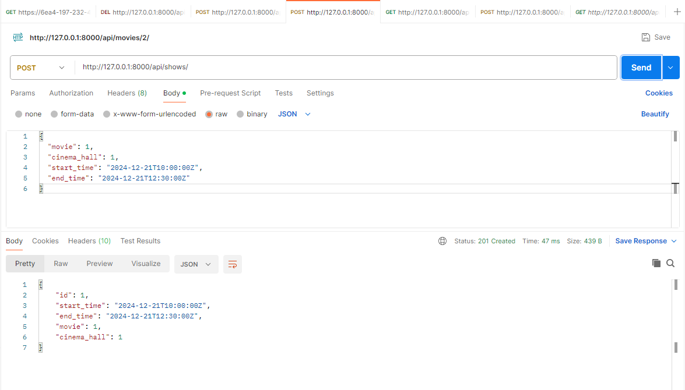
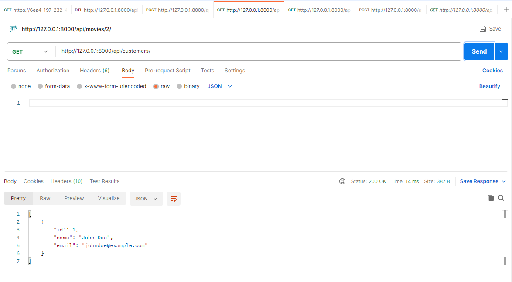
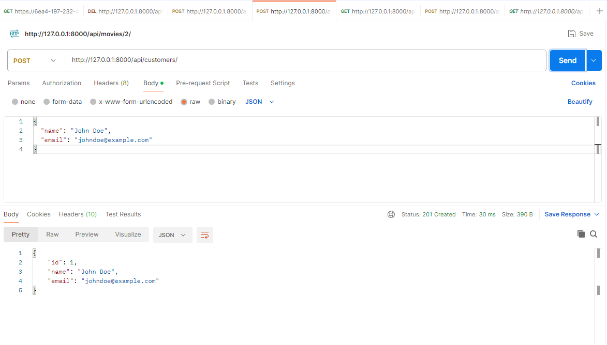
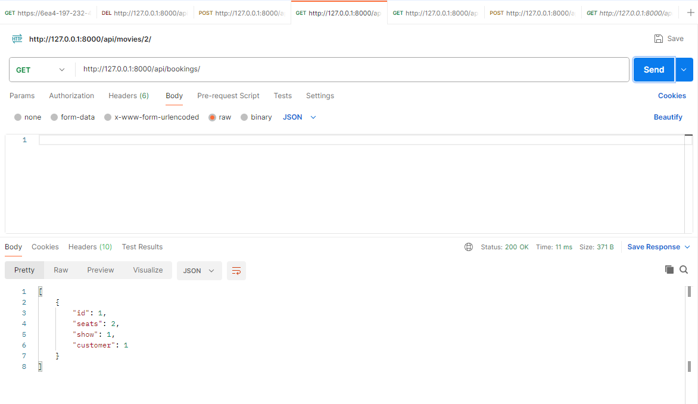
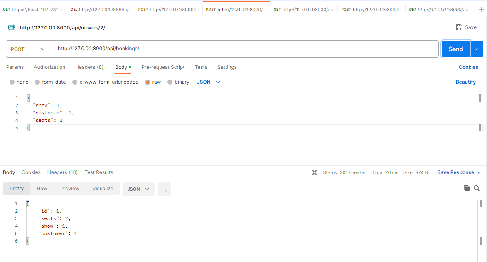

# Cinema Booking System

## Group Members:

- Patriciah -152569 Mariam - 147398 Robert -150233 Keith - 147478 Miles - 151090 - Ian Gatumu - 103435

## Project Description:

This is a simple API for a Cinema Booking System built using Django. It allows users to manage cinema bookings, movies, and related entities.

# Cinema Booking API

This project is a Cinema Booking System API built with Django REST Framework as registered in settings.py.
It supports CRUD operations for Movies, Cinema Halls, Shows, Customers, and Bookings.

## 1. Project Implementation

### Models and Relationships

# Movie Model

- Fields: `title`, `description`, `duration`, `release_date`.
- Relationships: A `Show` is associated with a `Movie`.

# CinemaHall Model

- Fields: `name`, `capacity`.
- Relationships: A `Show` is associated with a `CinemaHall`.

# Show Model

- Fields: `movie`, `cinema_hall`, `start_time`, `end_time`.
- Relationships: References a `Movie` and a `CinemaHall`.

# Customer Model

- Fields: `name`, `email`.
- Relationships: A `Booking` is associated with a `Customer`.

# Booking Model

- Fields: `show`, `customer`, `seats`.
- Relationships: References a `Show` and a `Customer`.

### Views/ViewSets and Their Roles

# MovieViewSet

- Handles CRUD operations for Movies.
- Example: List all movies or create a new movie.

# CinemaHallViewSet

- Manages Cinema Hall operations.
- Example: Update or delete a specific cinema hall.

# ShowViewSet

- Supports operations for Shows.
- Example: Create a new show or list all available shows.

# CustomerViewSet

- Manages Customer operations.
- Example: Retrieve details for a customer.

# BookingViewSet

- Handles bookings.
- Example: Book seats for a show.

### Serializers and Validation Rules

# MovieSerializer

- Ensures all fields (`title`, `description`, `duration`, `release_date`) are required.

# CinemaHallSerializer

- Validates that `capacity` is a positive integer.

# ShowSerializer:

- Validates that `start_time` is earlier than `end_time`.

# CustomerSerializer

- Ensures `email` follows a valid email format.

# BookingSerializer

- Validates that the number of `seats` booked does not exceed the available seats for a show.

### Patterns and Their Purpose

# /api/movies/

- **Purpose**: Manage Movies (GET, POST, PUT, DELETE).

# /api/cinema-halls/

- **Purpose**: Manage Cinema Halls (GET, POST, PUT, DELETE).

# /api/shows/

- **Purpose**: Manage Shows (GET, POST, PUT, DELETE).

# /api/customers/

- **Purpose**: Manage Customers (GET, POST, PUT, DELETE).

/api/bookings/

- **Purpose**: Manage Bookings (GET, POST, PUT, DELETE).

2. # Tests Conducted
   # 2.1 Postman Testing

- Endpoints tested for Movies, Cinema Halls, Shows, Customers, and Bookings.
- Each endpoint supports: RUD operations

#### Evidence of Tests

# Movies Endpoint:

- GET:  
  
- POST:  
  
- PUT:  
  
- DELETE:  
  

# Cinema Halls Endpoint

- GET:  
  
- POST:  
  

# Shows Endpoint

- GET:  
  
- POST:  
  

# Customers Endpoint

- GET:  
  
- POST:  
  

# Bookings Endpoint

- GET:  
  
- POST:  
  

# 2.2 Summary of Tests

All endpoints passed the CRUD operations with correct status codes as seen in the images:

- **200**: Success for GET requests.
- **201**: Success for POST requests.
- **204**: Success for DELETE requests.
- **400/404**: Handled invalid requests appropriately.
